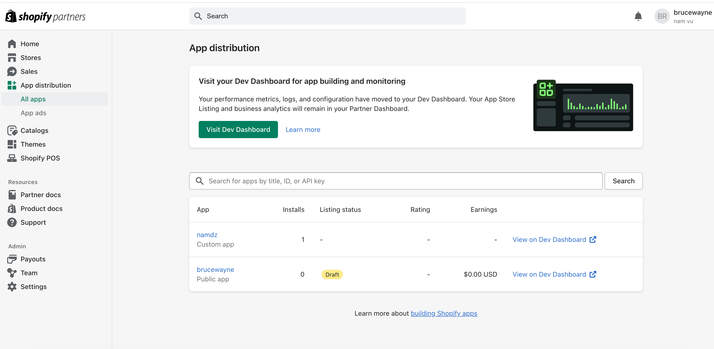
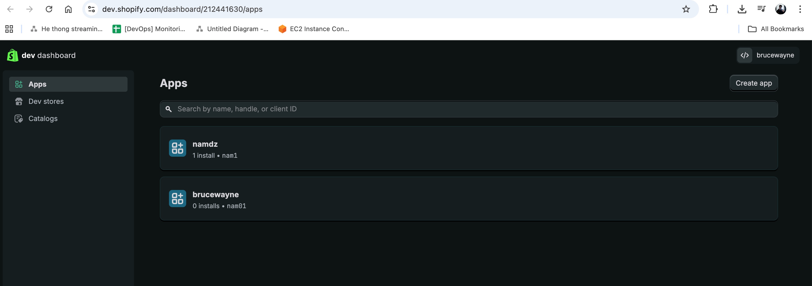
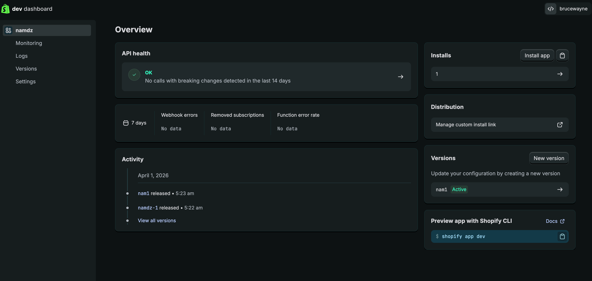
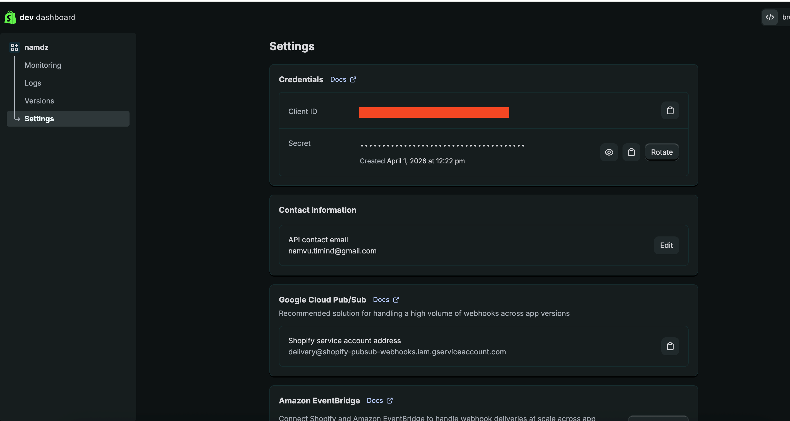

# Hướng dẫn tạo tài khoản và tạo app trên Shopify Partner

## 1. Tạo tài khoản Shopify Partner

1. Mở trang đăng ký chính thức:
   `https://www.shopify.com/partners`
2. Nhấn `Become a partner` hoặc `Sign up`.
3. Tạo Shopify account mới, hoặc đăng nhập nếu đã có tài khoản Shopify.
4. Làm theo các bước để tạo **Partner account** hoặc **Partner organization**.
5. Chấp nhận điều khoản của Shopify Partner Program nếu hệ thống yêu cầu.
6. Xác thực email và hoàn tất các bước bảo mật đăng nhập nếu Shopify yêu cầu.
7. Sau khi tạo xong, đăng nhập vào **Partner Dashboard**.

## 2. Màn hình cần vào

Sau khi đăng nhập, vào menu:

`App distribution` -> `All apps`

Đây là màn hình mẫu:



## 3. Tạo app từ màn hình `App distribution > All apps`

Từ màn hình trên, làm tiếp theo các bước sau:

1. Nhấn `Visit Dev Dashboard`.
2. Trong **Dev Dashboard**, chọn mục `Apps`.
3. Nhấn `Create app`.
4. Chọn cách tạo app phù hợp:
   - `Start from Dev Dashboard`: phù hợp khi cần tạo app nhanh để tích hợp API, webhook hoặc backend service
   - nếu bạn muốn làm app đầy đủ để publish, Shopify thường khuyến nghị dùng **Shopify CLI**
5. Nhập tên app.
6. Nhấn `Create`.



## 4. Cấu hình app sau khi tạo

Sau khi tạo app xong, cần cấu hình để app có thể hoạt động:

1. Vào tab `Versions`.
2. Cấu hình các thông tin cần thiết:
   - `App URL`
   - `Allowed redirection URL(s)` nếu app dùng OAuth
   - `Scopes` mà app cần sử dụng
   - `Webhooks API version` nếu app có dùng webhook
3. Nhấn `Release` để tạo version đầu tiên.

Lưu ý: app cần có ít nhất một version thì mới có thể cài vào store để test.

## 5. Cài app vào store để test

1. Vào trang chi tiết app vừa tạo.
2. Mở tab `Home` hoặc khu vực cài đặt chính của app.
3. Nhấn `Install app`.
4. Chọn một `dev store` hoặc store test phù hợp.
5. Xác nhận `Install`.



Sau bước này, app đã được cài vào store để bạn test API, webhook, OAuth hoặc các chức năng backend.

## 6. Quay lại `App distribution` để chọn kiểu phân phối

Sau khi app đã được tạo, bạn có thể quay lại **Partner Dashboard**:

1. Vào `App distribution` -> `All apps`.
2. Chọn app vừa tạo trong danh sách.
3. Nếu Shopify yêu cầu, nhấn `Choose distribution`.
4. Chọn một trong hai kiểu:
   - `Public distribution`: dùng khi muốn đưa app lên Shopify App Store
   - `Custom distribution`: dùng khi muốn phát hành app qua link cho một store hoặc một nhóm store cụ thể

Lưu ý quan trọng: sau khi đã chọn `distribution method`, Shopify không cho đổi ngược lại, nên cần chọn đúng ngay từ đầu.

### Cách tạo store để test app

Nếu bạn chưa có store test, có thể tạo một `dev store` trong Shopify Partner như sau:

1. Từ **Partner Dashboard**, chọn `Stores`.
2. Nhấn `Add store`.
3. Chọn `Create development store`.
4. Nhập các thông tin cơ bản của store:
   - tên store
   - URL của store
   - địa chỉ email quản trị
   - khu vực hoặc thị trường muốn test
5. Chọn mục đích sử dụng store, ví dụ để test app hoặc phát triển tính năng.
6. Nhấn `Create development store`.
7. Sau khi store được tạo xong, quay lại màn hình cài app và chọn store này ở bước `Install app`.

## 7. Lấy thông tin xác thực để dùng API

Nếu mục tiêu của bạn là tích hợp hệ thống ngoài với Shopify, làm tiếp:

1. Vào `Settings` của app trong **Dev Dashboard**.
2. Lấy các thông tin:
   - `Client ID`
   - `Client secret`
3. Dùng các thông tin này để thực hiện luồng xác thực và lấy access token.

Nếu app của bạn dùng OAuth, bạn cũng cần khai báo đúng:

- `App URL`
- `Allowed redirection URL(s)`


Ví dụ `curl` lấy access token:

```bash
curl -X POST \
  "https://bw2610.myshopify.com/admin/oauth/access_token" \
  -H "Content-Type: application/x-www-form-urlencoded" \
  -d "grant_type=client_credentials" \
  -d "client_id=xxxxxxxxxx" \
  -d "client_secret=xxxxxxxx"
```
- token lấy theo cách này có TTL khoảng 24 giờ và khi hết hạn thì gọi lại cùng token endpoint với cùng client credentials để lấy token mới.

## 8. Gọi Admin API bằng access token vừa lấy

Sau khi đã lấy được access token, bạn có thể gọi Shopify Admin API như sau:

```bash
curl -X POST \
  "https://bw2610.myshopify.com/admin/api/2026-04/graphql.json" \
  -H "Content-Type: application/json" \
  -H "X-Shopify-Access-Token: <ACCESS_TOKEN>" \
  -d '{"query":"{ shop { name id } }"}'
```

Lưu ý:

- thay `<ACCESS_TOKEN>` bằng token vừa lấy từ bước trước
- endpoint trên đang dùng phiên bản API `2026-04`,Shopify đặt version theo dạng YYYY-MM, phát hành mỗi 3 tháng một lần; 2026-04 là version phát hành vào 01/04/2026.(https://shopify.dev/docs/api/usage/versioning)
- câu query mẫu này dùng để kiểm tra nhanh token còn hiệu lực và app có gọi được Admin API hay chưa


## 9. Link chính thức nên dùng

- Trang đăng ký Shopify Partner: https://www.shopify.com/partners
- Shopify Dev Docs: https://shopify.dev/
- Chọn phương thức phân phối app: https://shopify.dev/docs/apps/launch/distribution/select-distribution-method
